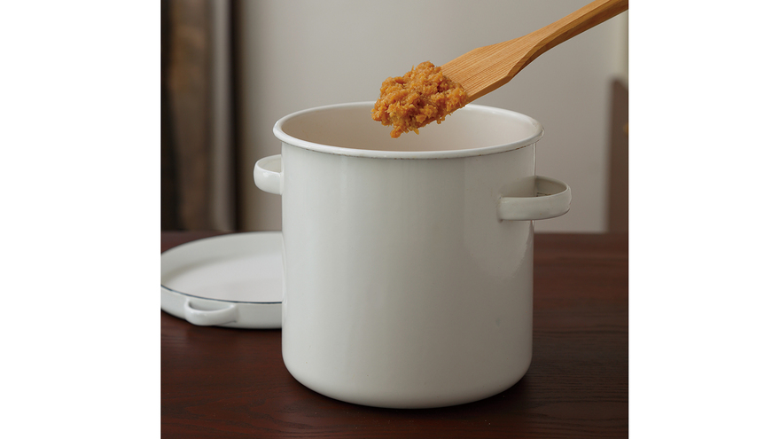

---
tags:
  - 調味料
  - 日本料理
  - 大豆
  - 発酵
---

# みそ

大豆と米こうじ、塩でつくる日本の伝統的な発酵調味料。じっくり発酵させることで深い旨味が生まれる。

| | |
|---|---|
| **人数** | つくりやすい分量 |
| **調理時間** | 約600分（戻し・熟成時間除く） |
| **カロリー** | 約3520 kcal（全量） |

## 材料

- 大豆（乾） 500g
- 米こうじ（乾） 500g
- 粗塩 250g
- 粗塩（振りかけ用） 適量

## 作り方

1. 大豆は洗ってからたっぷりの水につけ、一晩おいて戻す。
2. 大きな鍋に大豆と水1.5リットルを入れ、弱めの中火で8〜12時間煮る。途中、泡をすくい取り、大豆が水面から出ないように適宜水を足す。圧力鍋なら20分間煮て、圧が下がるまでおく。
3. 盤台（もしくは大きなボウル）に米こうじをあけ、ダマがなくなるまで手のひらではさんでよくもみほぐす。粗塩をまんべんなくまぶし、よくもみ込む（塩きり）。半量をボウルにとり分けておく。
4. 大豆が指でつまんで柔らかくつぶれる状態になったら火を止める。熱いうちに煮汁と大豆に分け、煮汁もとっておく。
5. 袋に移した大豆を、熱いうちに麺棒などで均等につぶして粗熱を取る。
6. 盤台に大豆の半量を加えてゴムべらで合わせ、なじんだら手で混ぜる。残りも同様にして全体を混ぜ合わせる。
7. 混ぜた感じがみそよりも堅いようなら、大豆の煮汁を適宜加えてゆるめ、みその堅さに調整する。
8. 直径20cm程度のみそ玉を数個つくって空気を抜き、保存容器に力強く投げ入れてさらに空気を抜く。
9. 空気が入らないように均等に詰めて、表面をならす。
10. 粗塩を一つかみ（約大さじ2）ふって落としぶたをし、さらに粗塩を二つかみふる。おもしをのせてふたをし、約3か月間ねかせる。水（たまり）が上がってきたら食べられる。

---

*Source : [kyounoryouri.jp](https://www.kyounoryouri.jp/recipe/18121_%E3%81%BF%E3%81%9D.html)*
